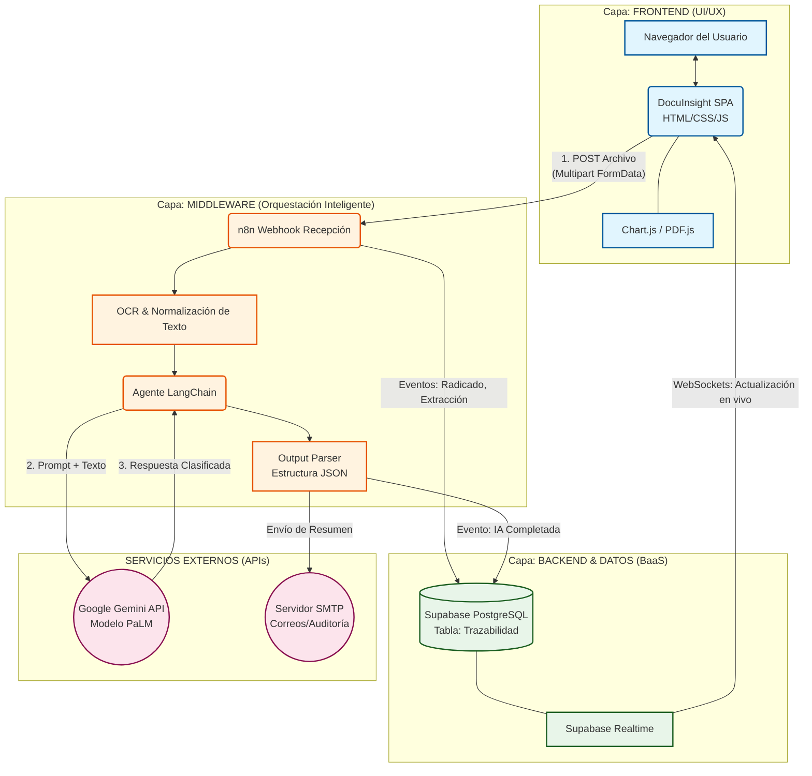

# DocuInsight - SinergIA Lab (Banco Falabella)

Plataforma de Alta Fidelidad para la Gestión Documental Inteligente y Extracción de Datos, diseñada para la automatización robótica (RPA) y la asistencia humana (Human-in-the-Loop).

## 🏢 Contexto y Funcionalidad
**DocuInsight** fue concebido y desarrollado como parte de un "SinergIA Lab" (Laboratorio de IA) orientado a revolucionar la ingesta y clasificación de documentos en operaciones bancarias o masivas. El sistema permite:

1. **Ingesta Multi-formato (Intake):** Recepción de documentos PDF, JPG, PNG masivamente.
2. **Procesamiento de IA:** Clasificación automática de tipologías (RUT, Cédulas, Certificados de Cámara de Comercio, Facturas) y extracción estructurada de los metadatos relevantes de cada uno usando LLMs.
3. **Tablero de Control Avanzado (Dashboard):** Visualización analítica de métricas operacionales (Tasa de Straight-Through Processing, Ahorro estimado, Distribución de volumen y Razones de Error).
4. **Validación Humana (Human-in-the-loop):** Una interfaz de pantalla dividida (Dúplex) donde el analista de operaciones puede cotejar visualmente el archivo contra lo extraído por el Robot, para confirmarlo o corregirlo.

## 🏗️ Arquitectura y Diagrama del Sistema
El proyecto emplea una arquitectura moderna, orientada a eventos, dividida claramente en tres capas (Frontend, Middleware/Orquestador y Backend/Datos) para asegurar escalabilidad y separación de responsabilidades:



### Detalle por Capas

#### 1. Frontend (Capa de Presentación)
- **Tecnologías:** Vanilla JavaScript estructurado orientada a objetos (POO), HTML5 Semántico, CSS3 moderno (Variables, Flexbox, Grid).
- **Librerías embebidas:** `Chart.js` para visualización de KPIs dinámicos, y `PDF.js` para el visor de documentos dúplex sin salir del navegador.
- **Responsabilidad:** Gestionar la carga de documentos de manera paralela o individual, renderizar las métricas y reportes (SLA, Rendimiento, Pareto) calculados sobre los datos locales en crudo, y reaccionar instantáneamente aplicando *Supabase Realtime* ante cualquier evento de la base de datos sin recargar la página.

#### 2. Middleware / Orquestador (Capa Lógica)
- **Tecnología:** [n8n](https://n8n.io/) operando como motor de Workflows (No-Code/Low-Code Backend).
- **Responsabilidad:** Actuar como el "cerebro central" del enrutamiento del dato. Recibe el archivo pesado, le extrae el texto (OCR básico), lo limpia y prepara dinámicamente el *Prompt*. 
- **Integración IA:** Usa nodos de LangChain para interactuar como Agente Cognitivo. El LLM (Gemini) se fuerza a devolver una estructura rígida (`Structured Output Parser`) para que siempre conteste exactamente los metadatos y no rompa el flujo de los siguientes sistemas.

#### 3. Backend, Datos y Storage (BaaS)
- **Tecnología:** [Supabase](https://supabase.com/).
- **Responsabilidad:** Almacenar la única fuente de la verdad (Single Source of Truth) en una base de datos relacional robusta (PostgreSQL). Lleva la bitácora (`trazabilidad_procesos`) de cada cambio de estado (Radicado ➜ OCR extraído ➜ Completado por IA ➜ Revisión Humana). Esto permite análisis históricos y auditorías en tiempo real.

#### 4. Notificaciones y Servicios Externos
- **Google Gemini (PaLM):** Motor responsable del Razonamiento y Análisis del Documento.
- **Servicio SMTP:** Nodo de n8n para despachar un resumen HTML estilizado a las casillas de correo designadas informando del finalizado de la etapa robótica.

## 🚀 Cómo Iniciar / Despliegue Local

### Prerrequisitos
- Tener instalado [Git](https://git-scm.com/downloads)
- Un servidor web estático sencillo (Python `http.server`, Node `http-server`, o extensión "Live Server" en VS Code).

### Paso 1: Clonar el Repositorio
Abre una terminal y ejecuta:
```bash
git clone https://github.com/mateopola/docuInsight.git
cd docuInsight
```

### Paso 2: Ejecutar la Interfaz de Usuario
El frontend es estático, por ende, sólo necesita ser servido localmente:

**Opción A (Python):**
```bash
python -m http.server 8000
```
Abre en tu navegador: `http://localhost:8000`

**Opción B (Node.js vía npx):**
```bash
npx http-server -p 8000
```

### Paso 3: Integración
Para que toda la cadena funcione localmente (simulación de backend):
1. Asegúrate de tener una instancia de **n8n** corriendo en tu entorno o en Docker que reciba las solicitudes en la ruta especificada en `app.js` (`const N8N_WEBHOOK_URL`).
2. Importa el archivo `workflows.json` adjunto en tu instancia de n8n.
3. Asegúrate de configurar tus propias credenciales para Supabase, Google Gemini y SMTP en n8n.
4. Sustituye, si lo deseas, las credenciales "anon key" en el archivo `app.js` para enlazar a tu entorno propio de Supabase.

---
**Desarrollado para la optimización de métricas de eficiencia (Speed, Cost Savings y STP) eliminando labores mecánicas de digitación en las células de revisión.**
